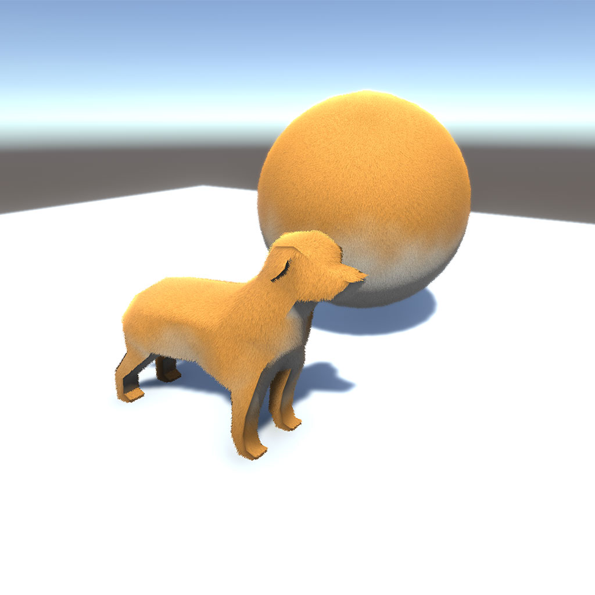

# Shiba

Special Shader for Good Dogs

# How to use

1. Create a dog primitive (see [Unity Docs](https://docs.unity3d.com/Manual/PrimitiveObjects.html#Dog))

2. Attach Shiba material to MeshRenderer

3. Woof

# Advanced

You can also use this shader for "Shiba" (means Grass in Japanese)

